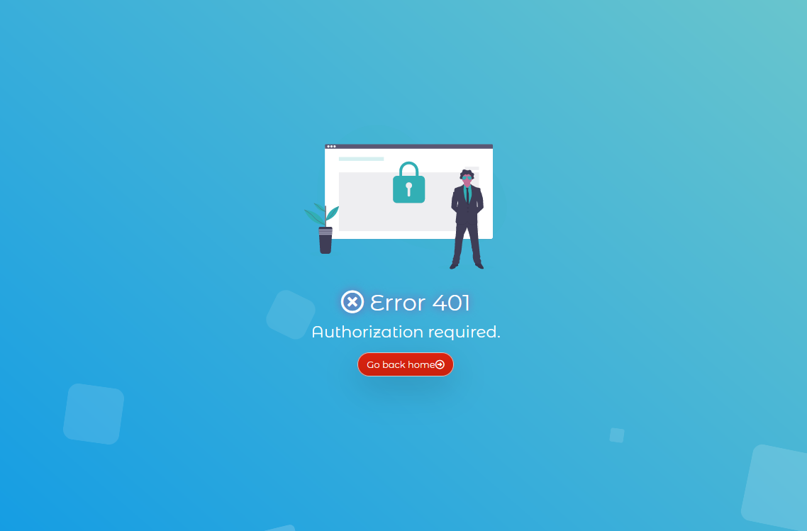
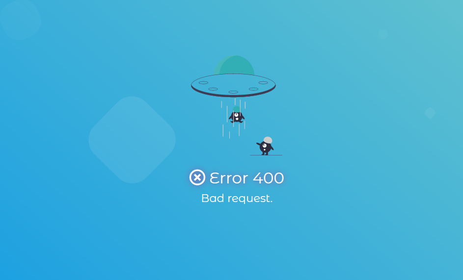

<h1 align="center">CumulusCloud Pages</h1>

    All the errors page of CumulusCloud.
       

<h2>Including:</h2>
    <ul>
        <li>400: Bad request</li>
        <li>401: Authorization required</li>
        <li>403: Forbidden</li>
        <li>404: Not found</li>
        <li>406: Not acceptable</li> 
        <li>407: Proxy authentification required</li>
        <li>412: Precondition failed</li>
        <li>414: Request URI too long</li>
        <li>415: Unsupported Media Type</li>
        <li>500: Internal server error</li>
        <li>501: Not implemented</li>
        <li>502: Bad gateway</li>
        <li>503: Maintenance</li>
    </ul>

The pages was made for <a href="https://cumuluscloud.fr">CumulusCloud</a>; you can use it respecting the M.I.T. license.  
Using <a href="https://undraw.co">undraw.co</a> for the images.

